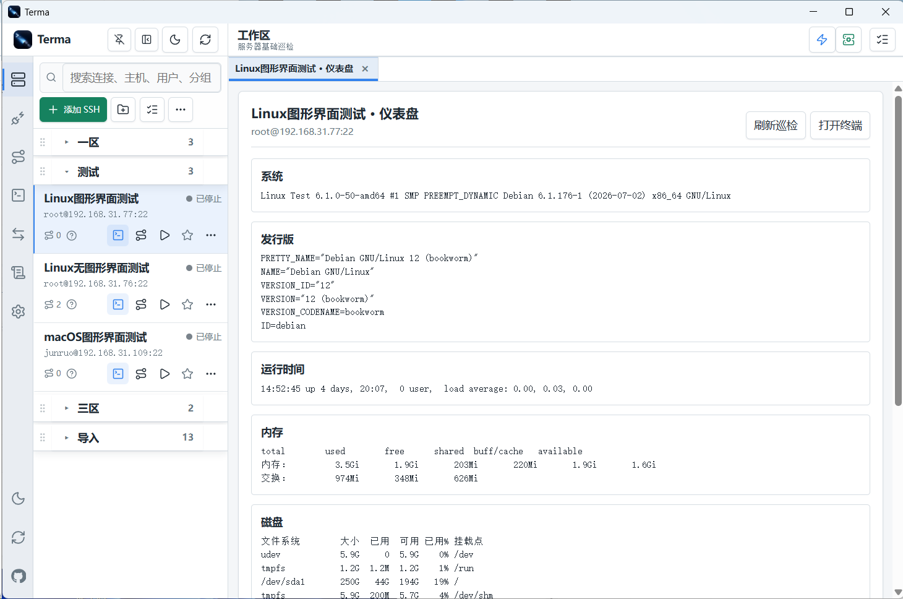
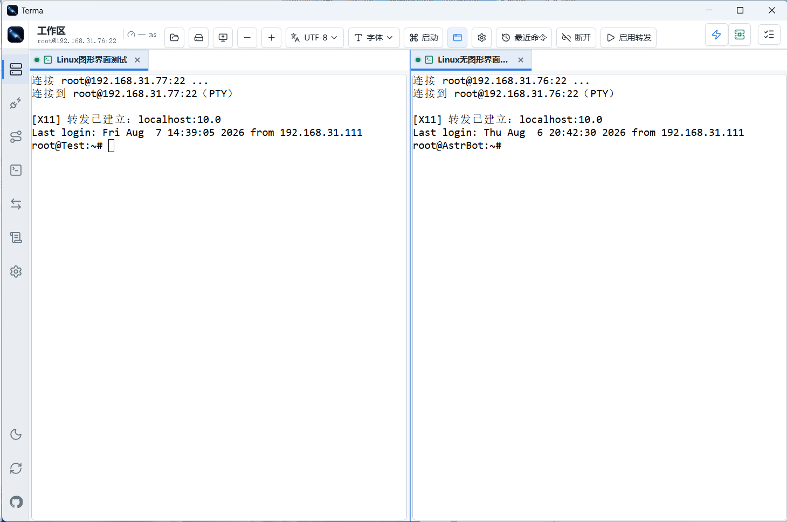
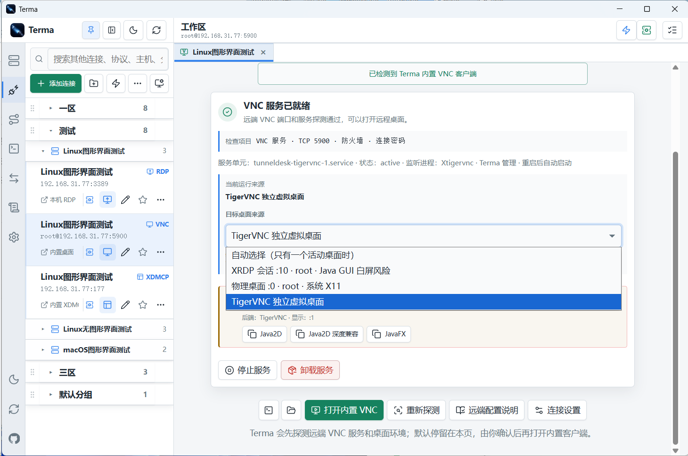
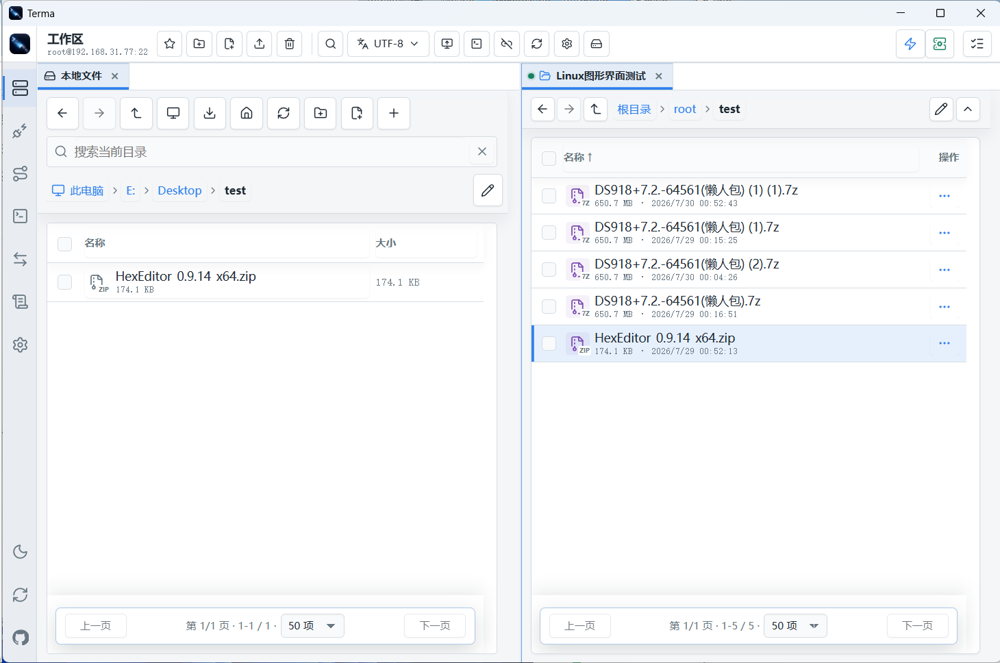
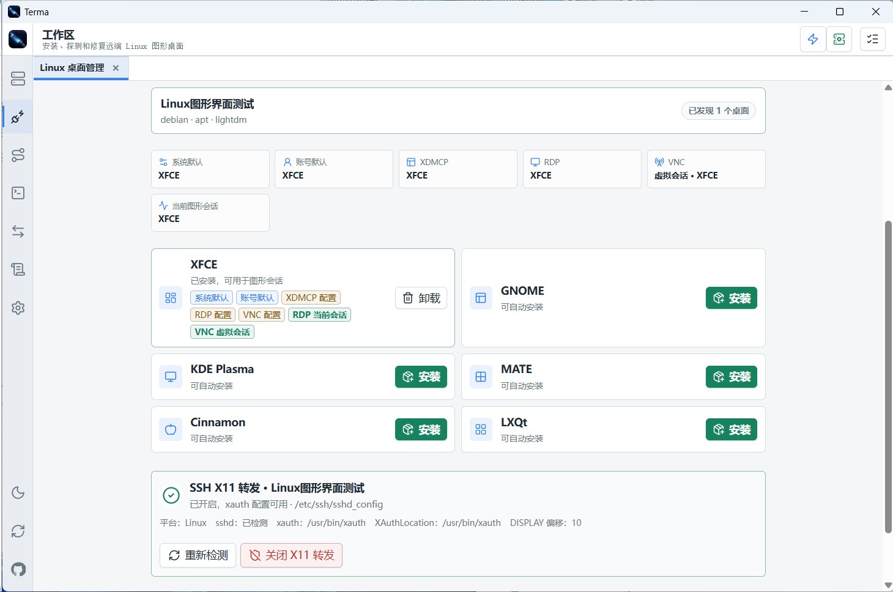
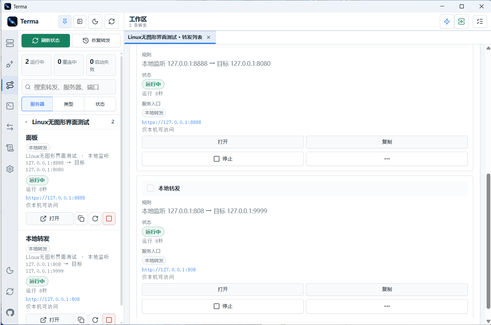

# Terma

Terma 是一个面向桌面端和自托管 Web 的远程连接工作台，用于集中管理 SSH、终端、SFTP、远程桌面、端口转发和批量命令。

> 名称迁移：Terma 保留对旧版 TunnelDesk 数据和 `TUNNELDESK_*` 环境变量的兼容；桌面版发现旧数据时会提示迁移，旧目录仍保留供回滚。

[下载最新版本](https://github.com/zmide/Terma/releases/latest) · [查看版本记录](https://github.com/zmide/Terma/releases) · [GPL-3.0 许可](LICENSE)

<p align="center">
  
</p>

## 界面预览

<table>
  <tr>
    <td width="50%"><strong>终端会话与运行诊断</strong><br></td>
    <td width="50%"><strong>远程桌面与其他连接</strong><br></td>
  </tr>
  <tr>
    <td colspan="2"><strong>SFTP 文件管理</strong><br></td>
  </tr>
  <tr>
    <td colspan="2"><strong>Linux 桌面管理</strong><br></td>
  </tr>
  <tr>
    <td colspan="2"><strong>端口转发</strong><br></td>
  </tr>
</table>

## 项目特点

- 一套数据同时服务 Electron 桌面端、浏览器和移动端 Web，不需要维护两份连接配置。
- SSH 连接、终端、SFTP、隧道转发和批量运维集中在同一个多标签工作区。
- 支持 Windows、macOS 和 Linux 桌面包，也可在 Linux 服务器或 Termux 中以 Web 模式运行。
- 支持私钥和密码登录、配置加密、数据库备份恢复、SSH config 导入导出。
- 默认仅监听本机地址，局域网访问可启用密码、会话管理和可信代理策略。

## 核心功能

### SSH 与工作区

- SSH 连接分组、搜索、标签、收藏、最近使用、排序、批量修改和健康检查。
- 支持密码、普通或加密私钥口令及 SSH Agent，可读取用户 `~/.ssh` 和运行数据目录中的密钥，并提供 Ed25519 密钥生成与公钥部署向导。
- 首次连接会显示 SHA-256 主机指纹供确认，主机密钥变化时提供醒目的风险警告；终端、SFTP、转发和批量命令共用同一份信任记录。
- 终端、命令和转发默认优先使用内置 SSH，遇到安全兼容的 OpenSSH 专用配置时自动回退系统 OpenSSH；支持结构化超时、保活设置和单级跳板机。
- 右上角闪电入口和 `Ctrl+K` 可打开全局快速面板，搜索连接、标签、命名工作区、命令片段和常用操作；命令片段支持变量、收藏、导入导出、插入终端或确认后批量执行。
- 工作区多标签、固定标签、误关恢复和桌面端递归分屏；可从标签或标签栏空白处进入组合模式，用左键或 `Ctrl/Cmd` 选择标签组成独立工作区，并拖动调整工作区顺序。每个工作区保留自己的标签与分屏布局，也可完整保存为可搜索、预览、修复引用和导入导出的命名预设。
- 服务器基础信息、运行状态和监听端口检查。

### 终端

- 多会话 Web 终端，优先使用本地 PTY，不可用时自动回退到 SSH 远程 PTY。
- 测试 SSH 时可识别远端默认 Shell、常用 Shell、Python/Node 和会话工具；启动配置既可保存到连接，也可只对当前标签临时生效。
- 可将本机文件或文件夹直接拖入终端当前目录，也可把 SFTP 远端项目拖到终端或另一个 SFTP 标签；遇到同名项目可选择覆盖、按 `(1)`、`(2)` 自动改名或取消。
- UTF-8、GB18030/GBK、Big5、Shift_JIS、EUC-KR、ISO-8859-1 编码切换。
- 字体、字号、行距和字重可按连接保存，支持 `Ctrl + 鼠标滚轮` 调整字号。
- 最近命令、快捷键栏、右键操作、终端日志和交互延迟显示。
- 可选择多个终端组成同步组，在其中任意终端输入都会同步到整组；多行、危险命令和隐藏输入会额外确认或自动暂停。
- 标签可提示新输出、命令完成和连接断开；长任务在后台结束后可发送通知，并支持按连接或标签静音。
- 可将终端选中路径或当前目录直接在 SFTP 中打开，`Ctrl+Shift+T` 可恢复最近关闭的终端或 SFTP 标签。
- 移动端提供 Esc、Tab、方向键、Ctrl 组合键和命令输入栏。

### SFTP

- 文件和目录浏览、搜索、排序、分页、收藏、上传、下载和在线文本编辑。
- 桌面端可在终端或 SFTP 中新建一个或多个“本地文件”标签，并按新标签或上、下、左、右分屏打开；本地文件使用与 SFTP 一致的工具栏、面包屑、多选和分页布局，本地与远端 SFTP 标签可直接拖拽互传，远端项目也可一键发送到桌面。Windows 盘符根目录向上可进入“此电脑”并切换其他磁盘。
- 新建、重命名、删除、回收站、权限与所有者修改、压缩和解压。
- 工作区标题栏提供全局任务中心，统一显示 SFTP 传输、目录同步和 Linux 桌面安装/卸载进度；默认同时显示不遮挡标题栏的悬浮进度卡，可临时关闭或永久静默，并在通用设置的“任务中心”中重新开启。
- 文件名编码和文本内容编码独立设置，兼容常见中日韩传统编码。
- 支持同主机复制移动，以及在两台 SSH 主机之间直接流式复制。
- 桌面端可使用系统程序、VS Code 或自定义编辑器修改远端文件并在保存后自动回传，远端冲突时可备份覆盖、另存为或取消。
- 桌面端支持本地与远端目录比较及上传、下载、双向同步；执行前可逐项确认，冲突默认不处理，任务支持取消、失败重试和结果导出。
- 终端与 SFTP 可按当前连接互相跳转。

### 远程桌面与其他协议

- SSH 与其他协议使用独立活动入口；RDP、VNC、XDMCP、FTP/FTPS、Telnet 和串口可单独分组、搜索和新增，也可在新增 SSH 时或其更多菜单中按协议生成单个或全部默认配置。
- RDP 使用系统原生客户端，由 SSH 生成的配置会按目标地址直接打开并由客户端询问桌面账号；macOS 未安装 Windows App 时可使用 Microsoft 官方独立 PKG，支持提前放入下载目录后离线安装。VNC 可选择 Terma 内置查看器、系统客户端或自动优先内置，可选加密保存密码，并在工作区内完成控制、双向剪贴板自动同步、全屏和重连；鼠标默认按远端平台自动选择显示策略，也可在 VNC 工具栏手动显示或隐藏本地光标。权限受限时仍可手动收发剪贴板，密码错误时可重新输入并更新保存密码。
- Windows 桌面包内置并管理 X Server；macOS 由 Terma 管理 XQuartz 的启动、停止和 XDMCP 窗口，Linux 复用当前图形桌面并使用 Xephyr。X11 入口会通过 SSH 自动识别远端已安装的终端、工具、文件管理器、浏览器和桌面会话，保存密码的连接也可直接启动，并支持自定义程序；macOS 可探测 XQuartz、xauth、sshd 和 `XAuthLocation`，缺少组件时可在程序内安装官方 XQuartz。
- Linux 桌面管理可通过 SSH 识别 Debian、Ubuntu、RHEL、Fedora、Arch、openSUSE 等发行版，探测并安装或卸载常见桌面环境；卸载后会按核心启动程序重新验证，不会默认清理无关的自动依赖。XDMCP、桌面管理、RDP 会话修复、SSH X11 转发和远端 X11/XQuartz 安装可使用仅限本次操作的管理员密码、私钥或 SSH Agent，凭据不会保存。X Server 管理可检查、开启或关闭远端 SSH X11 转发，启用 X11 的终端连接会直接显示实际转发结果。
- Windows、Linux 和 macOS 桌面版均支持 XDMCP 直接查询、间接查询和局域网广播；Windows 使用随包组件，Linux 使用 Xephyr，macOS 使用 XQuartz 提供的 Xephyr。Terma 可通过同主机 SSH 连接探测桌面会话、显示管理器和 UDP 177，管理 LightDM 和仍保留 XDMCP 的旧版 GDM；GDM 50 及以上或 Debian/Ubuntu 的 SDDM 可经确认切换为 LightDM，并只撤销自身添加的 UFW/firewalld 规则。XDMCP 不加密，只应在可信局域网使用。
- FTP/FTPS 提供内置文件工作区；Telnet 和串口提供内置终端，并分别支持常用终端编码和串口参数。

### 转发与批量运维

- 本地转发 `-L`、远程转发 `-R` 和 SOCKS5 动态代理 `-D`。
- 每条转发规则独立启停，可使用模板、自动重连和启动恢复。
- 正在转发页面集中展示服务地址、运行状态和异常信息。
- 可复制本地访问地址、代理地址和目标地址，并快速测试连通性。
- 批量命令可选择多台主机执行，支持命令模板和 TXT/JSON 结果导出。

### 数据与更新

- SQLite 保存连接、转发、设置和任务状态。
- 数据库备份恢复、配置快照和加密迁移包。
- 数据库恢复时可重新绑定私钥或补充密码，不要求旧机器路径保持一致。
- 桌面端可检查 GitHub Releases，并按系统、架构和安装类型选择更新文件；下载前会自动比较直连和可用加速线路，优先使用较快线路并在失败时换线，安装包仍会校验 SHA-256。

## 架构

```text
Electron 桌面端 ─┐
浏览器 / 手机 ───┼─> Web UI（public/）
                 │        │ HTTP / WebSocket
                 └─> Node.js 服务（src/ -> dist/）
                          ├─ SSH / PTY / X11 / 端口转发
                          ├─ SFTP / FTP / VNC / 远程协议
                          ├─ SQLite / 日志 / 备份
                          └─ 更新与运行设置
```

桌面端只是同一套 Web UI 和 Node.js 服务的 Electron 容器，因此桌面端与 Web 模式使用相同的数据结构和功能实现。

| 目录 | 说明 |
| --- | --- |
| `src/` | TypeScript 后端、SSH、终端、SFTP、认证和数据服务 |
| `public/` | 原生 HTML、CSS 和 JavaScript 前端 |
| `desktop/` | Electron 主进程、预加载脚本和桌面图标 |
| `scripts/` | 启停、测试、依赖检查、打包和发布辅助脚本 |
| `data/` | 源码运行时的本地数据库、设置、日志和密钥目录 |
| `.github/workflows/` | Release 跨平台构建流程 |

## 平台支持

| 平台 | 桌面端 | Web 模式 | 发布产物 |
| --- | --- | --- | --- |
| Windows 10/11 | 支持 | 支持 | 安装版、便携版 |
| macOS | 支持 | 支持 | DMG 安装镜像、ZIP 免安装运行包 |
| Linux | 支持 | 支持 | AppImage、DEB、RPM |
| Termux / 无图形 Linux | 不建议 | 支持 | 源码运行 |

## 运行要求

- Node.js 22 或更高版本
- npm
- Git（从仓库获取源码时）
- OpenSSH 客户端，命令行可执行 `ssh`
- macOS 使用 X11/XDMCP 时需安装 XQuartz，Terma 可在本机下载、校验并请求管理员授权安装，也可通过 SSH 探测远端 X11 状态；macOS RDP 需安装 Windows App 或可用的 FreeRDP。Linux 使用 X11 时需具备桌面 DISPLAY 和 `xauth`，XDMCP 客户端需 Xephyr，完整远端桌面还需支持 XDMCP 的显示管理器监听 UDP 177（优先使用 LightDM；GDM 50 及以上已不支持）

从源码运行前获取项目：

```sh
git clone https://github.com/zmide/Terma.git
cd Terma
```

启动脚本会检查 `package.json` 和 `package-lock.json`。依赖缺失或清单发生变化时会自动执行安装，然后编译并启动程序。

## 从源码运行

### Windows

```bat
start.bat
stop.bat
```

### Linux / macOS

```sh
chmod +x start.sh stop.sh
./start.sh
./stop.sh
```

有图形环境时启动脚本会优先打开桌面端；Electron 不可用或明确启用 Web-only 时会运行后台 Web 服务。默认访问地址为：

```text
http://127.0.0.1:8088
```

### Termux / 无图形服务器

Termux 首次准备环境：

```sh
pkg update
pkg upgrade
pkg install git nodejs openssh
```

启动 Web 模式：

```sh
chmod +x start.sh stop.sh
TERMA_WEB_ONLY=1 ./start.sh
./stop.sh
```

Termux 和无图形 Linux 不打包桌面程序；`start.sh` 会自动检查依赖、编译源码并启动 Web 服务。

### 局域网访问

推荐在“设置 > 启动与运行”中选择监听地址并设置 Web 密码。也可以临时使用：

```sh
TERMA_LAN=1 ./start.sh
# 或
TERMA_WEB_ONLY=1 ./start.sh --host 0.0.0.0 --port 8088
```

常用环境变量：

| 变量 | 作用 |
| --- | --- |
| `TERMA_WEB_ONLY=1` | 只启动 Web 服务 |
| `TERMA_LAN=1` | 临时监听全部 IPv4 网卡 |
| `TERMA_NO_BROWSER=1` | Web 模式启动后不自动打开浏览器 |
| `TERMA_DATA_DIR` | 覆盖运行数据目录 |
| `TERMA_SSH_DIR` | 覆盖 SSH 密钥目录 |
| `TERMA_RESET_WEB_ACCESS=1` | 重置 Web 密码和访问 Token |
| `TERMA_DISABLE_UPDATE_CHECK=1` | 关闭启动时自动检查更新 |
| `TUNNEL_WEB_HOST` | 指定监听地址 |
| `TUNNEL_WEB_PORT` | 指定监听端口，默认 `8088` |

旧版 `TUNNELDESK_WEB_ONLY`、`TUNNELDESK_LAN` 等同名变量仍作为兼容输入，新脚本和新部署应改用 `TERMA_*`。

## 开发与验证

```sh
npm install --include=dev
npm run build
npm run native:build:if-needed
npm run desktop:run
```

常用检查：

```sh
npm run check:strict
npm run regression
npm run ui:smoke
```

## 桌面端编译与打包

桌面包包含各平台的 SFTP 原生拖放模块，因此必须在对应系统构建。先准备工具链：

- Windows：Visual Studio 2022 C++ Build Tools（“使用 C++ 的桌面开发”）；打包脚本会下载并校验固定版本的 VcXsrv 运行时。
- Linux（Debian / Ubuntu）：`build-essential cmake fuse3 libcurl4-openssl-dev libfuse3-dev nlohmann-json3-dev pkg-config rpm`。
- macOS：Xcode Command Line Tools，可执行 `xcode-select --install` 安装。

在当前平台安装依赖并生成安装包：

```sh
npm ci
npm run dist
```

指定平台和产物：

```sh
# Windows x64：安装版与便携版
npm run dist -- --win nsis portable --x64 --publish never

# Linux x64：AppImage、DEB、RPM
npm run dist -- --linux AppImage deb rpm --x64 --publish never

# macOS：Intel 与 Apple Silicon
npm run dist -- --mac dmg zip --x64 --arm64 --publish never
```

构建结果位于 `release/`。各平台运行方式：

- Windows 安装版：运行 `*-installer.exe` 并按向导安装；便携版直接运行 `*-portable.exe`。
- Linux：AppImage 执行 `chmod +x release/*.AppImage` 后即可运行；DEB、RPM 使用系统包管理器安装。
- macOS DMG：打开与机器架构对应的 `.dmg`，将 Terma 拖入“应用程序”后启动。
- macOS ZIP：解压后可直接运行 `Terma.app`，无需安装；它只表示应用免安装，运行数据仍保存在系统用户数据目录。Intel 选择 `x64`，Apple Silicon 选择 `arm64`。

推送 `v*` 标签时，Release 工作流会在 Windows、Linux 和 macOS 上分别构建并验证产物。

## 从 TunnelDesk 升级

- 新桌面标识为 `com.zmide.terma`，主程序和 Linux 包名使用 `terma`；Windows 安装向导、macOS `/Applications/Terma.app` 和 Linux 应用菜单均使用 Terma。旧 TunnelDesk 安装不会被当作新程序继续写入。
- 桌面数据默认迁移到 Windows `%APPDATA%\Terma\runtime`、Linux `~/.config/Terma/runtime`、macOS `~/Library/Application Support/Terma/runtime`。旧 `TunnelDesk` 目录只作为迁移来源并保留供回滚。
- “导入导出 > 旧版数据迁移”可重新探测并一键迁移。新旧目录都已有数据时不会静默覆盖；确认迁移后会先备份当前 Terma 数据。
- Terma 会识别旧版备份、`TUNNELDESK_*` 兼容变量和远端 `tunneldesk-*` 管理配置。新建的 XDMCP、VNC 与 SSH X11 配置使用 `terma` 名称；迁移成功前不要手工删除旧配置或旧应用。

## 数据与安全

- 源码运行和 Windows 便携版默认使用项目内 `data/`；安装版默认使用系统用户数据目录，可在设置中迁移到其他位置。
- SSH 密码、私钥路径、访问 Token 和数据库备份属于敏感数据，请保护运行数据目录并按需启用配置加密。
- 已永久信任的 SSH 主机密钥保存在运行数据目录，可在“设置 > 安全”中查看或删除；删除后下次连接会重新确认指纹。
- 服务默认只监听 `127.0.0.1`。局域网访问应设置 Web 密码；远程访问建议通过 Tailscale、ZeroTier、WireGuard 等私有网络。
- 不建议将 Terma 直接暴露到公网。它可以操作终端、SFTP、隧道、密钥和备份，风险高于普通只读管理页面。
- 不要提交 `data/`、`.ssh/`、日志或数据库备份。

## 许可

Terma 使用 [GNU General Public License v3.0](LICENSE) 发布，随包第三方组件及对应源码位置见 [THIRD_PARTY_NOTICES.md](THIRD_PARTY_NOTICES.md)。
